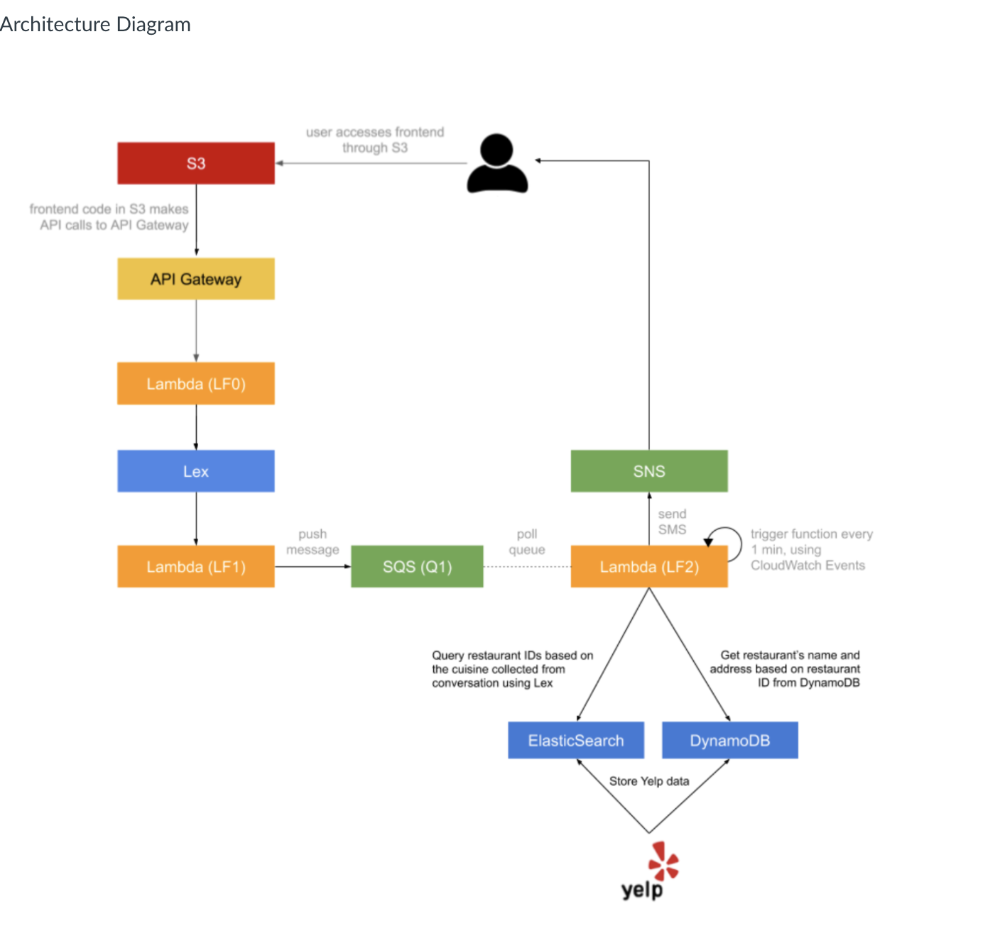

# Cloud Computing & Big Data: Assignment 1: Dining Concierge Agent #
### Andy Chan & Taku Takamatsu ###

## About ##

Project repository for COMS6998: Cloud Computing & Big Data course, Assignment #1. We implemented a serverless, microservice-driven web application on AWS that recommends restaurants (strictly in New York), given a requested cuisine (Japanese, Chinese, Mexican, etc.).

Core features of this project include:
1. User accesses front-end website hosted on AWS S3
2. Front-end client sends API request to API Gateway and communicates with AWS Lex through a Lambda function (LF0).
3. Based on the conversation intents, trained on Lex, the user proceeds with inputting additional information for their dining request (ie. # of location, cuisine, number of people dining, date, time and phone number).
4. Lambda function (LF1) processes each Intent and sends a request to LF2 once the user finalizes all input data. This message is published to a queue (Amazon SQS) and triggers another Lambda function (LF2) that performs the search. 
5. LF2 queries Elasticsearch (AWS Opensearch) and generates 3 restaurant recommendations. A DynamoDB table, storing all restaurant information, is then queried for restaurant metadata (location, hours, ratings, reviews, etc.). Aggregating this data, the recommendations are processed and pushed to Amazon SNS (text-message queue) to send an SMS to the end-user. 
6. LF2 additionally stores a record of the user and search history in DynamoDB.
7. When a user returns to the site, an API request is sent to API Gateway -> Lambda (LF3), which queries DynamoDB for historical recommendations, given a userID. If found, the suggestions are returned to the front-end. 

## Website Link ##
http://ccbchatbot.com.s3-website-us-west-2.amazonaws.com/

Sample Architecture (From Assignment):

